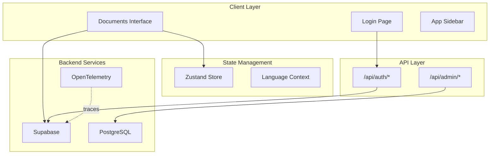
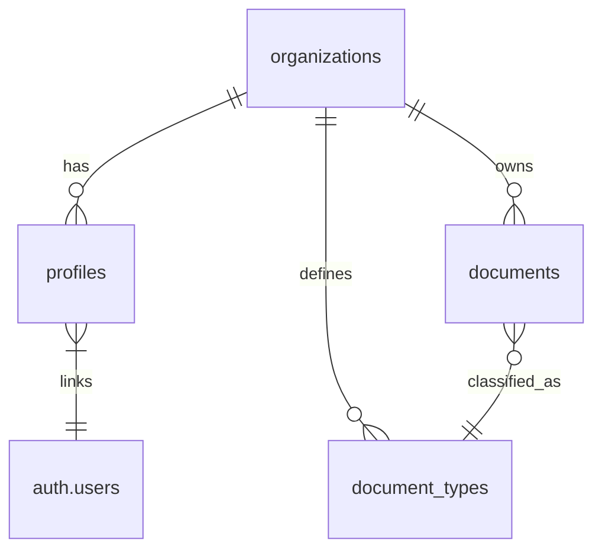

# ULTRATHINK: OCR Interface Deep Analysis Report

> **Project**: Smatch OCR Dashboard  
> **Stack**: Next.js 16 + React 19 + Supabase + TypeScript + TailwindCSS 4  
> **Analysis Date**: 2026-01-04

---

## Executive Summary

This is a **multi-tenant OCR document management platform** built for processing invoices, delivery notes, and commercial documents. The architecture is production-ready with solid foundations, but reveals several **critical security concerns**, **performance bottlenecks**, and **maintainability issues** that require immediate attention.

| Dimension | Score | Notes |
|-----------|-------|-------|
| **Security** | 6/10 | RLS in place, but SQL injection vectors & hardcoded admin checks |
| **Performance** | 7/10 | Real-time optimized, but O(n) loops in critical paths |
| **Maintainability** | 6/10 | Monster component (~1150 lines), duplicate stores |
| **Type Safety** | 8/10 | Strict mode, but `any` escapes in key places |
| **Edge Case Handling** | 7/10 | Good fallbacks, but race conditions possible |

---

## 1. Architecture Overview



### Key Architectural Decisions

1. **Multi-Tenancy via RLS**: Organizations are isolated at the database level using PostgreSQL Row-Level Security.
2. **Hybrid API Strategy**: Uses both Supabase client SDK and direct PostgreSQL connections (via `pg` pool).
3. **Real-Time Updates**: Supabase Postgres Changes subscription for live document updates.
4. **Observability**: OpenTelemetry SDK with auto-instrumentation for HTTP, FS, and Fetch.

---

## 2. Security Analysis (OWASP Top 10)

### 🔴 CRITICAL: SQL Injection Vulnerability

```typescript
// File: src/app/api/admin/create-schema/route.ts:127
const createTableQuery = `
  CREATE TABLE IF NOT EXISTS public."${targetTable}" (
    id UUID PRIMARY KEY DEFAULT gen_random_uuid(),
    document_id UUID REFERENCES documents(id),
    ...
    ${columnsSql}
  );
`;
await client.query(createTableQuery);
```

> [!CAUTION]
> **Impact**: An authenticated admin could inject arbitrary SQL via `targetTable` or `columnsSql`.  
> **Fix**: Use allowlist validation for table names and parameterized column definitions.

### 🟠 HIGH: Hardcoded Super Admin Check

```typescript
// File: src/app/api/admin/create-schema/route.ts:60
const ADMIN_ORG_ID = '37dcc0d0-2f83-4c05-98a2-8788a51a1fcc';
if (profile.organization_id !== ADMIN_ORG_ID) { ... }
```

> [!WARNING]
> **Issue**: Hardcoded UUIDs are fragile and not environment-aware.  
> **Fix**: Move to environment variable or database flag (`is_super_admin` column).

### 🟠 HIGH: Service Role Key Exposure Risk

The `SUPABASE_SERVICE_ROLE_KEY` is used in multiple API routes. While server-side, any console.log leak or error response could expose it.

```typescript
// Recommendation: Add explicit redaction
const supabaseAdmin = createClient(url, serviceKey, {
  auth: { autoRefreshToken: false, persistSession: false },
  // Add: global fetch configuration to strip sensitive headers from logs
});
```

### 🟡 MEDIUM: Missing CSRF Protection

No CSRF tokens are implemented on POST endpoints. While Supabase auth provides some protection, the custom `/api/auth/signup` and `/api/admin/*` routes are vulnerable to cross-site request forgery.

### 🟢 GOOD: Security Headers

```typescript
// File: next.config.ts:27-36
{
  key: 'X-Content-Type-Options', value: 'nosniff',
  key: 'X-Frame-Options', value: 'DENY',
  key: 'X-XSS-Protection', value: '1; mode=block',
}
```

**Missing**: `Content-Security-Policy`, `Strict-Transport-Security` (HSTS).

---

## 3. Performance Analysis

### 🔴 O(n²) Document Detection

```typescript
// File: src/lib/document-schema.ts:211
detectDocumentType(payload: Record<string, any>): string | null {
  for (const [typeName, typeInfo] of this.documentTypes) {
    if (this.matchesSchema(payload, typeInfo.schema)) {
      return typeName;
    }
  }
  return null;
}
```

> **Issue**: For `n` documents and `m` schema types, this is O(n × m).  
> **Fix**: Pre-compile schemas into a decision tree or use fingerprinting.

### 🟠 Real-time Subscription Leak Potential

```typescript
// File: src/hooks/use-real-time.ts:121
}, [onDocumentsUpdate, organization?.id])
```

> **Issue**: If `onDocumentsUpdate` changes identity on each render (common with inline functions), the subscription will be recreated repeatedly.  
> **Fix**: Use `useCallback` for `onDocumentsUpdate` in the parent or memoize with `useMemo`.

### 🟡 Bundle Size Concerns

```json
"@opentelemetry/auto-instrumentations-node": "^0.67.2",
```

This package pulls in **60+ instrumentation libraries**. On Vercel Edge functions, this could cause cold start issues.

**Recommendation**: Replace with selective imports:
```typescript
import { HttpInstrumentation } from '@opentelemetry/instrumentation-http';
```

### 🟢 Good: Pagination Support

```typescript
// File: src/components/documents-interface.tsx:103
loadDocuments() // Implements offset-based pagination
```

---

## 4. Maintainability Analysis

### 🔴 CRITICAL: Monster Component

```typescript
// File: src/components/documents-interface.tsx
// Total Lines: 1150 | Functions: 18+
```

This component handles:
- Document loading & pagination
- Real-time subscriptions
- Schema initialization
- Authentication checks
- Export (CSV/JSON)
- Grouping logic
- Keyboard shortcuts
- File uploads
- Confidence review
- Document type management

> [!IMPORTANT]
> **Refactor Strategy**: Extract into focused modules:
> - `useDocuments()` hook for data fetching
> - `useDocumentExport()` hook for export logic
> - `DocumentsProvider` context for shared state
> - `KeyboardShortcuts` component
> - `FileUpload` component

### 🟠 Duplicate Stores

```
src/stores/
├── auth-store.ts (169 lines)
└── auth-store-updated.ts (168 lines, nearly identical)
```

> **Action**: Delete the duplicate and ensure single source of truth.

### 🟡 Dynamic Require (Anti-Pattern)

```typescript
// File: src/lib/utils.ts:112
const { documentSchemaService } = require('./document-schema')
```

> **Issue**: Dynamic `require()` breaks tree-shaking and type safety.  
> **Fix**: Use proper ES imports with async initialization.

### 🟡 Magic Strings Throughout

```typescript
type: 'invoice' | 'BL' | 'BC' | 'CO' | 'OTHER'
status: 'extracted' | 'needs review' | 'failed' | 'processing'
```

> **Fix**: Extract to enums or constants:
```typescript
export const DocumentStatus = {
  EXTRACTED: 'extracted',
  NEEDS_REVIEW: 'needs review',
  // ...
} as const;
```

---

## 5. Type Safety Analysis

### 🟠 `any` Escapes

| File | Line | Issue |
|------|------|-------|
| `document-schema.ts` | 100 | `const d: any = docType` |
| `document-schema.ts` | 733 | `private convertToJsonSchema(schemaData: any)` |
| `create-schema/route.ts` | 75 | `requiredFields.reduce((acc: any, field: any)` |

### 🟢 Good: Strict Mode Enabled

```json
// tsconfig.json
"strict": true
```

### 🟢 Good: Interface Definitions

```typescript
// File: src/types/document.ts
export interface Document { ... }
export interface AuditEvent { ... }
export interface KPIData { ... }
```

---

## 6. Edge Case Analysis

### 🔴 Race Condition: Signup Flow

```typescript
// File: src/app/api/auth/signup/route.ts:71
// Rollback: Delete the organization we just created
await supabaseAdmin.from("organizations").delete().eq("id", orgId);
```

> **Issue**: If the delete fails after user creation fails, orphaned orgs accumulate.  
> **Fix**: Use database transactions:
```sql
BEGIN;
INSERT INTO organizations...;
INSERT INTO auth.users...;
COMMIT;
-- Or ROLLBACK on any error
```

### 🟠 Null Supabase Client

```typescript
// File: src/lib/supabase.ts:13
export const supabase = (url && anon) ? createClient(url, anon) : null
```

This is handled gracefully in most places but not all:

```typescript
// File: src/hooks/use-real-time.ts:117
if (channel && supabase) {
  supabase.removeChannel(channel) // ✅ Good
}
```

But:

```typescript
// File: src/app/login/page.tsx:45
const { error } = await supabase.auth.signInWithPassword(...) // ❌ supabase could be null
```

### 🟡 Date Validation

```typescript
// File: src/lib/document-mapper.ts:105
if (isNaN(receivedAt.getTime())) {
  receivedAt.setTime(Date.now()) // Good fallback
}
```

---

## 7. Database Schema Analysis

### Multi-Tenancy Model



### RLS Policy Summary

| Table | Admin Access | Client Access |
|-------|--------------|---------------|
| `documents` | Full CRUD | Own org only |
| `document_types` | Full CRUD | Read own org |
| `organizations` | Full CRUD | Read own only |
| `profiles` | Full CRUD | Read/Update self |

### 🟠 Migration Complexity

19 migration files with interdependencies. Some migrations attempt to modify tables that may not exist:

```sql
-- File: 20241112000001_multi_tenancy_setup.sql:22
ALTER TABLE document_types RENAME TO document_categories;
```

> **Risk**: Running migrations on a fresh database will fail if `document_types` doesn't exist.

---

## 8. Recommendations (Priority Order)

### Immediate (P0 - This Week)

1. **Fix SQL Injection** in `create-schema/route.ts`
2. **Add CSRF Protection** to all POST endpoints
3. **Delete Duplicate Store** `auth-store-updated.ts`

### Short-Term (P1 - Next Sprint)

4. **Refactor `documents-interface.tsx`** into sub-components
5. **Replace Hardcoded Admin UUID** with env variable
6. **Add CSP Headers** to `next.config.ts`

### Medium-Term (P2 - Next Month)

7. **Optimize Schema Detection** with decision tree
8. **Add Database Transactions** to signup flow
9. **Replace Dynamic Require** with ES imports
10. **Selective OpenTelemetry Imports** to reduce bundle

### Long-Term (P3 - Roadmap)

11. **Extract Constants/Enums** for magic strings
12. **Add Integration Tests** for API routes
13. **Implement Rate Limiting** on auth endpoints
14. **Add Audit Logging** for admin actions

---

## 9. Project Health Metrics

| Metric | Value | Status |
|--------|-------|--------|
| TypeScript Coverage | ~95% | 🟢 |
| Component Test Coverage | ~0% | 🔴 |
| API Route Test Coverage | ~0% | 🔴 |
| Largest Component | 1150 lines | 🔴 |
| Total Dependencies | 34 runtime + 13 dev | 🟡 |
| Migration Files | 19 | 🟡 |
| Security Headers | 3/6 recommended | 🟡 |

---

## 10. Files Analyzed

| Category | Files |
|----------|-------|
| **Configuration** | `package.json`, `tsconfig.json`, `next.config.ts`, `vercel.json` |
| **Core Components** | `documents-interface.tsx`, `app-sidebar.tsx`, `login/page.tsx` |
| **API Routes** | `create-user/route.ts`, `create-schema/route.ts`, `signup/route.ts` |
| **Libraries** | `supabase.ts`, `utils.ts`, `document-schema.ts`, `document-mapper.ts` |
| **State** | `auth-store.ts`, `use-real-time.ts` |
| **Types** | `document.ts`, `document-schema.ts` |
| **Migrations** | 19 SQL files in `supabase/migrations/` |
| **Styles** | `globals.css` |

---

*This analysis was generated using the ULTRATHINK protocol with maximum depth across security, performance, maintainability, and edge case dimensions.*
